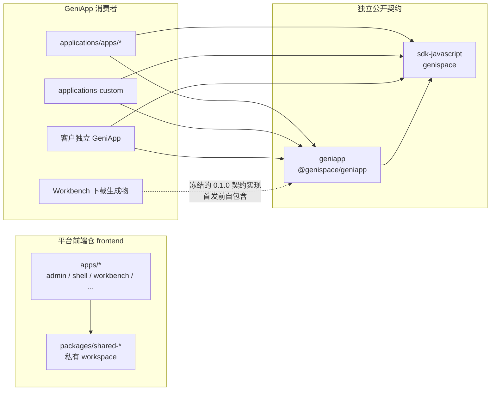
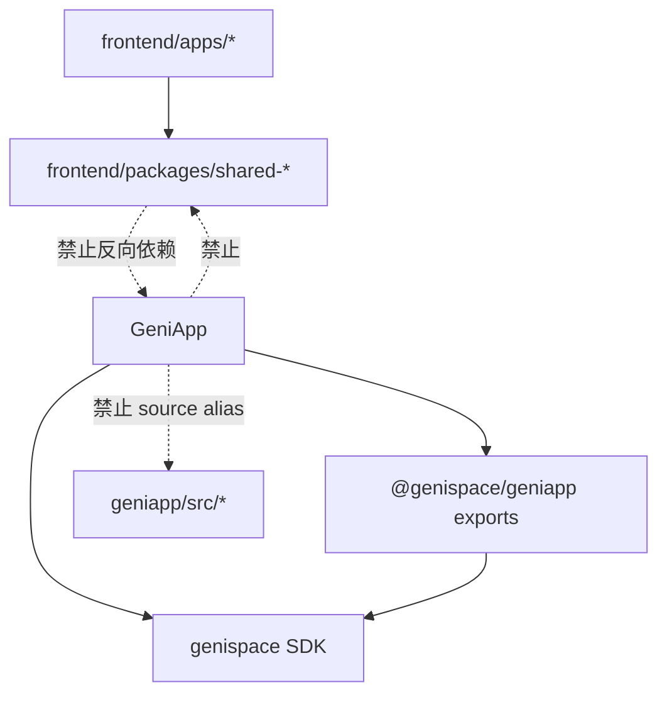
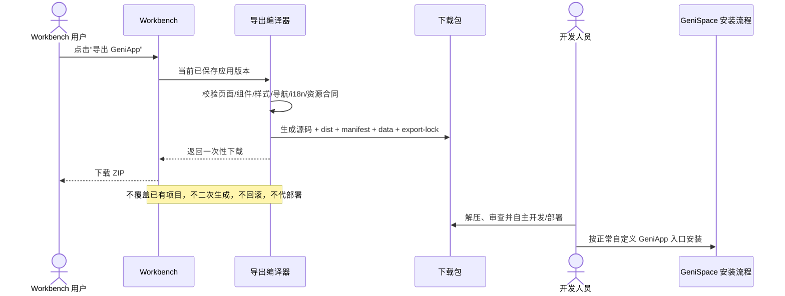
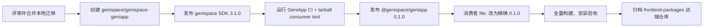

# GeniApp 公开开发包与前端共享层拆分实施方案

> 状态：已完成本地代码迁移与核心验收，待团队评审后创建远端仓库并执行 npm 首次发布。  
> 目标版本：`@genispace/geniapp@0.1.0`  
> 适用范围：`frontend`、`applications`、`applications-custom`、客户 GeniApp、Workbench 一键导出 GeniApp。

## 1. 决策摘要

废止原 `frontend-packages` 共享仓库，按使用者和发布周期拆为两个清晰边界：

1. 平台前端专属能力归入 `frontend/packages/shared-*`，只在 `frontend` pnpm workspace 内使用，不对 GeniApp 开发者承诺兼容性。
2. 新建独立 `geniapp` 项目，发布公开 npm 包 `@genispace/geniapp`，作为第一方、客户定制和 Workbench 导出 GeniApp 的 UI、Shell、主题、运行时与构建合同。
3. 平台 API 访问继续由公开 `genispace` SDK 负责；`@genispace/geniapp` 不复制 HTTP/SSE 客户端。
4. Workbench 仍是低代码平台。“一键转换为 GeniApp”只是新增的下载能力，不替代 Workbench，不引入覆盖生成、回滚、代部署或代安装流程。

这需要一个独立项目/仓库，而不仅是在 `applications` 中再建一个目录。原因是公开开发包需要独立版本、许可证、变更日志、npm provenance、兼容性策略和发布权限；如果继续放在平台前端或应用仓中，仍会把内部实现周期泄漏给外部开发者。

## 2. 最终架构



### 2.1 所有权矩阵

| 能力 | 权威位置 | 消费者 | 兼容承诺 |
|---|---|---|---|
| 平台管理端、Shell、Workbench 私有组件 | `frontend/packages/shared-*` | `frontend/apps/*` | 仓内兼容，随平台原子升级 |
| GeniApp Sidebar、Page、Kit、主题、移动端规则 | `@genispace/geniapp` | 所有 GeniApp | SemVer 公共合同 |
| Shell iframe 上下文与路由同步 | `@genispace/geniapp/shell` | 所有 GeniApp | 消息协议兼容 |
| manifest/data 复制、base path、构建分包 | `@genispace/geniapp/vite` | GeniApp 构建 | 构建合同兼容 |
| 平台 API、Agent stream | `genispace` SDK | 前端与 GeniApp | GeniApp 版本精确锁定 SDK 版本 |
| Workbench 编辑模型和低代码渲染器 | `frontend/apps/workbench` | Workbench | 平台内部合同 |
| 导出源码、dist、manifest、表与资源合同 | Workbench 编译器 | 下载后的独立项目 | `geniappContractVersion` 标识 |

### 2.2 允许和禁止的依赖方向



必须遵守：

- GeniApp 只能从 `@genispace/geniapp` 声明的 `exports` 引入，不能引用 `dist` 内部文件或 `src`。
- GeniApp 的 Vite alias、TypeScript paths 不得指向 `frontend`、旧 `frontend-packages` 或 `geniapp/src`。
- `frontend/packages/shared-*` 可以快速演进，但不得被外部应用当成公共 API。
- 公共能力若同时被平台前端需要，应由双方分别通过明确接口消费；不要恢复源码同步目录。

## 3. 新项目与 npm 包

建议创建独立 GitHub 仓库：`genispace/genispace-geniapp`。

```text
geniapp/
├── .github/workflows/
│   ├── ci.yml
│   └── publish.yml
├── docs/
│   └── ARCHITECTURE_AND_MIGRATION.md
├── scripts/
├── src/
│   ├── ui/
│   ├── kit.ts
│   ├── hooks/
│   ├── shell/
│   ├── ai/
│   ├── storage/
│   ├── dashboard/
│   ├── case-workspace/
│   ├── task-workspace/
│   ├── styles/
│   └── vite/
├── LICENSE
├── README.md
└── package.json
```

项目采用 MIT 许可证、公开 npm access、npm provenance 和 Git tag 发布。当前本地依赖使用 `file:../../../geniapp` 只是首发前的集成方式；正式发布后必须改为精确版本 `"@genispace/geniapp": "0.1.0"` 并提交 lockfile。

### 3.1 公共入口

| npm entry | 主要合同 |
|---|---|
| `@genispace/geniapp` | 常用 UI、hooks、Shell bridge 汇总 |
| `/ui` | `AppSidebar`、`AppPage`、页面状态、表单和用户展示 |
| `/kit` | 经筛选的 Button、Card、Dialog、Table、Sheet 等基础组件 |
| `/page` | 页面级布局合同 |
| `/utils` | 路由、格式化、className 等无状态工具 |
| `/hooks` | RBAC、平台客户端、路由和 locale hooks |
| `/shell` | iframe 初始化、主题、locale、token 与双向路由同步 |
| `/vite` | manifest/data 复制、base path、optimizeDeps、manualChunks |
| `/ai` | 受管数据源、AI 采纳与业务布局模式 |
| `/storage` | 平台存储 UI/辅助能力 |
| `/dashboard` | Dashboard 筛选、KPI 与图表模式 |
| `/case-workspace` | Case workspace 合同 |
| `/task-workspace` | Task workspace 合同 |
| `/styles.css` | 字体、亮/暗主题令牌、响应式布局与组件 CSS |
| `/tailwind-preset` | GeniApp Tailwind 语义色、断点和插件配置 |

所有未列入 `package.json#exports` 的文件均为实现细节。

## 4. GeniApp 接入标准

### 4.1 依赖

首发后应用使用精确版本：

```json
{
  "dependencies": {
    "@genispace/geniapp": "0.1.0",
    "genispace": "3.1.0",
    "i18next": "^24.2.2",
    "react": "^18.3.1",
    "react-dom": "^18.3.1",
    "react-i18next": "^15.4.0",
    "react-router-dom": "^6.22.3"
  }
}
```

### 4.2 UI、主题和多语言

```tsx
import { AppPage, AppSidebar } from '@genispace/geniapp/ui';
import { Button, Card } from '@genispace/geniapp/kit';
import { GeniAppShellBridge } from '@genispace/geniapp/shell';
import '@genispace/geniapp/styles.css';

export function App() {
  return (
    <>
      <GeniAppShellBridge
        identifier="customer-operations"
        allowedShellOrigins={["https://app.genispace.ai"]}
      />
      <AppSidebar groups={[]} />
      <AppPage title="Customer operations">
        <Card><Button>New</Button></Card>
      </AppPage>
    </>
  );
}
```

- 桌面左导航必须使用公共 `AppSidebar` 合同，保持与现有 GeniApp 的宽度、折叠、激活态、层级和亮/暗色样式一致。
- 手机端由同一 Sidebar 合同切换为抽屉/移动导航，不另建只在桌面可用的导航实现。
- 亮色与黑色模板由 Shell bridge 同步主题属性和 CSS 语义令牌；业务组件不得硬编码只适合一种主题的颜色。
- `@genispace/geniapp` 提供 locale 同步和可注入标签，应用仍拥有自己的 i18n namespace 与业务翻译。

### 4.3 Tailwind

```js
import geniappPreset from '@genispace/geniapp/tailwind-preset';

export default {
  presets: [geniappPreset],
  content: [
    './index.html',
    './src/**/*.{js,ts,jsx,tsx}',
    './node_modules/@genispace/geniapp/dist/**/*.{js,mjs}',
  ],
};
```

### 4.4 构建与平台合同

```ts
import { defineConfig } from 'vite';
import {
  copyGeniAppBundle,
  geniappBasePath,
  geniappOptimizeDeps,
} from '@genispace/geniapp/vite';

export default defineConfig(({ command, mode }) => ({
  base: geniappBasePath({
    command,
    mode,
    identifier: 'customer-operations',
    version: '1.0.0',
  }),
  plugins: [copyGeniAppBundle({ appRoot: __dirname })],
  optimizeDeps: geniappOptimizeDeps,
}));
```

构建插件必须把 `manifest.json` 和完整 `data/` 平台合同复制到 `dist/`，以便走现有自定义 GeniApp 的 URL 导入、安装与资源迁移流程。

## 5. Workbench 一键转换边界



生成项目是普通 GeniApp，不使用 `generated/` 与 `custom/` 分层。导出完成后 Workbench 与生成项目彼此独立，原低代码应用继续存在，二者可同时安装、打开和比较。

### 5.1 首发阶段为何仍自包含

Workbench 下载包当前内置一份冻结的 GeniApp `0.1.0` 契约实现，并在 `manifest`、`export-lock` 和生成 README 中记录 `geniappContractVersion`。这样在 npm 首次发布前，用户下载源码后也能立即安装和构建，不会引用一个尚不存在的 registry 包。

`@genispace/geniapp@0.1.0` 正式发布并完成生产可用性验证后，可另立版本将新导出物切换为 npm 精确依赖；这不是本次交付的必要条件，也不改变“只下载、不代部署”的产品边界。

## 6. 已实施迁移

| 范围 | 实施结果 |
|---|---|
| `frontend` | 私有包移入 `frontend/packages/shared-*`；workspace、Vite、Vitest、tsconfig、Docker 与 CI 不再引用兄弟 `frontend-packages` |
| `geniapp` | 独立公开包骨架、公共 exports、类型声明、样式、测试、CI 与 publish workflow 已建立 |
| `applications` | 52 个第一方 GeniApp 全部改用 `@genispace/geniapp`，移除共享源码 alias |
| `applications-custom` | 开发脚手架改用公开包合同 |
| `applications-brightfood` | 实际客户应用改用公开包合同并通过回归 |
| Workbench 导出 | 增加 `geniappContractVersion: 0.1.0`，保留源码/dist/平台合同的自包含下载 |
| `frontend-packages` | 标记只读废止；现役仓库不再消费其源码 |

## 7. 验收标准与本地结果

| 验收项 | 结果 |
|---|---|
| `frontend` 私有包构建 | 5/5 package build 通过 |
| `frontend` 全量类型检查 | 通过 |
| `@genispace/geniapp` 类型、单测、构建 | 通过；2/2 测试通过 |
| 公共 Kit exports 完整性 | 101 个现有应用所需 symbol 均存在 |
| 第一方 GeniApp 类型检查 | 52/52 通过 |
| 第一方 GeniApp production build | 52/52 通过 |
| `applications-brightfood` | 类型检查通过；78/78 测试通过；production build 通过 |
| `applications-custom` | 类型检查、测试、production build 通过 |
| Workbench 导出编译器 | 2 个 suite、6/6 测试通过；覆盖复杂多页面/多组件/自定义样式、移动导航、亮/暗主题、双语和平台合同 |
| npm tarball 纯消费者 | 通过；独立临时项目安装 `.tgz` 后成功加载 17 个公共入口，无源码 alias |

完整的 Workbench 双应用对比证据见根目录 `docs/acceptance/workbench-to-geniapp-local-acceptance-report.md`。

## 8. 首次发布与切换步骤



发布顺序不能颠倒：`@genispace/geniapp@0.1.0` 的 peer dependency 精确要求 `genispace@3.1.0`，CI 也固定检出 SDK tag `v3.1.0` 并校验版本，因此 npm 上必须先有 SDK `3.1.0`。

需要仓库管理员执行的外部动作：

1. 创建公开或组织可见仓库 `genispace/genispace-geniapp`，把当前 `geniapp/` 设为其根目录。
2. 确认 npm `@genispace` scope、包名、2FA/automation token 与 provenance 权限。
3. 审核 MIT 许可证以及哪些组件允许成为公共 API。
4. 发布并验证 `genispace@3.1.0`。
5. 从干净 Git tag 发布 `@genispace/geniapp@0.1.0`。
6. 将各应用的临时 `file:` 依赖替换成精确 npm 版本，更新 lockfile 后再次验收。
7. 确认所有生产 CI 已切到新仓库后，将旧 `frontend-packages` 远端仓库设为 archived；本地历史副本可按团队保留策略处理。

本次实现不会自动创建远端仓库、占用 npm 包名或发布版本，因为这些动作需要组织权限和正式发布授权。

## 9. 版本与治理

- 使用 SemVer。删除/改名公共 export，改变 Shell message、CSS token、导航尺寸或 manifest 构建行为均视为 breaking change。
- 每个 `@genispace/geniapp` 版本精确绑定一个 `genispace` SDK 版本；不能用 `^`、`~` 或大范围 peer range。SDK 升级通过新的 GeniApp 版本和完整应用回归交付。
- GeniApp 在 lockfile 中固定已发布版本；升级通过常规 PR 和全量验收，不通过源码 alias 偷渡。
- 公共包 CI 至少执行 type-check、unit test、build、`pnpm pack` 和 tarball consumer test。
- 新公共 symbol 必须说明用途、移动/暗色/i18n 行为及兼容责任；仅平台内部使用的组件留在 `frontend/packages`。
- Workbench 导出器版本与 `geniappContractVersion` 分开记录：前者表示编译器变化，后者表示生成应用遵循的公共运行时合同。
- 安全相关修改（Shell allowed origins、token 注入、平台 URL）需要独立审查；消息发送方不能通过 payload 把自己加入可信来源。

## 10. 评审检查清单

- [ ] 同意建立独立 `genispace-geniapp` 项目和 npm 包，而非恢复跨仓源码共享。
- [ ] 确认公开 exports 的范围、MIT 许可与维护团队。
- [ ] 确认 SDK `3.1.0` 与 GeniApp `0.1.0` 的发布顺序。
- [ ] 确认平台前端私有包与公开 GeniApp 包允许少量实现重复，优先维护清晰所有权。
- [ ] 确认 Workbench 只负责一次性下载，不负责覆盖、回滚、部署和安装。
- [ ] 确认移动导航、桌面导航一致性、亮/暗主题和多语言是每次版本升级的强制回归项。
- [ ] 确认远端切换完成后归档 `frontend-packages`。
